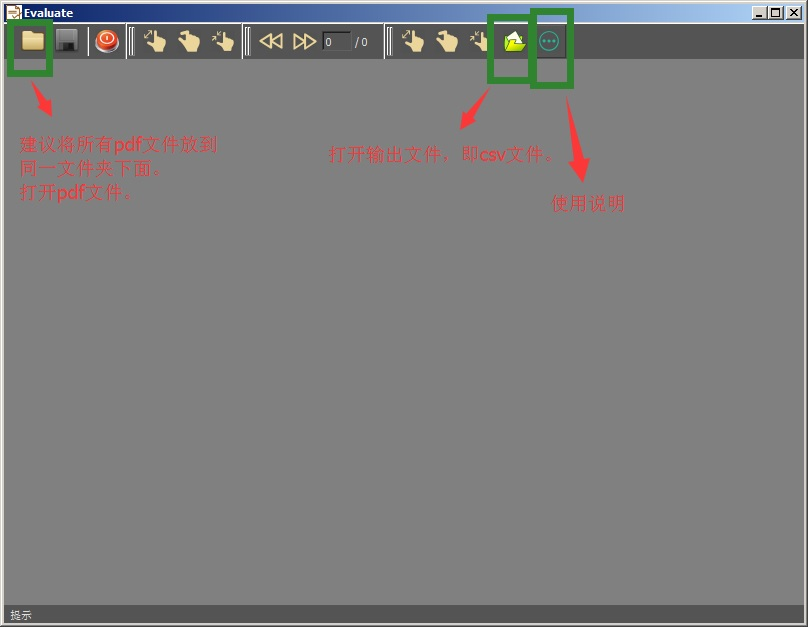
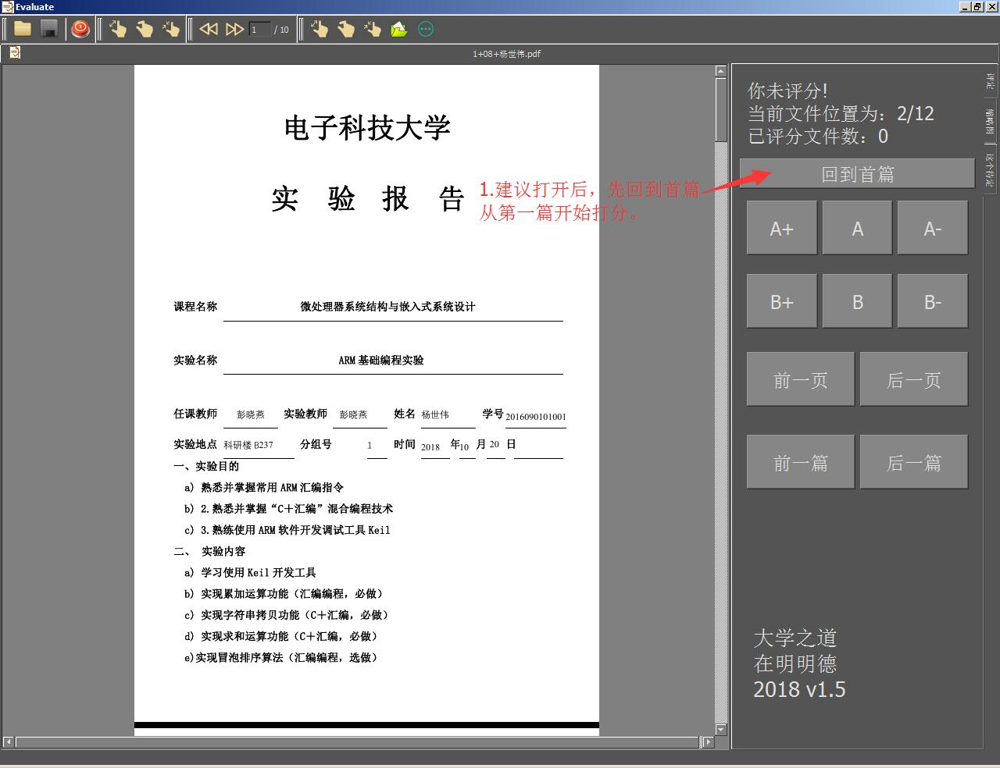
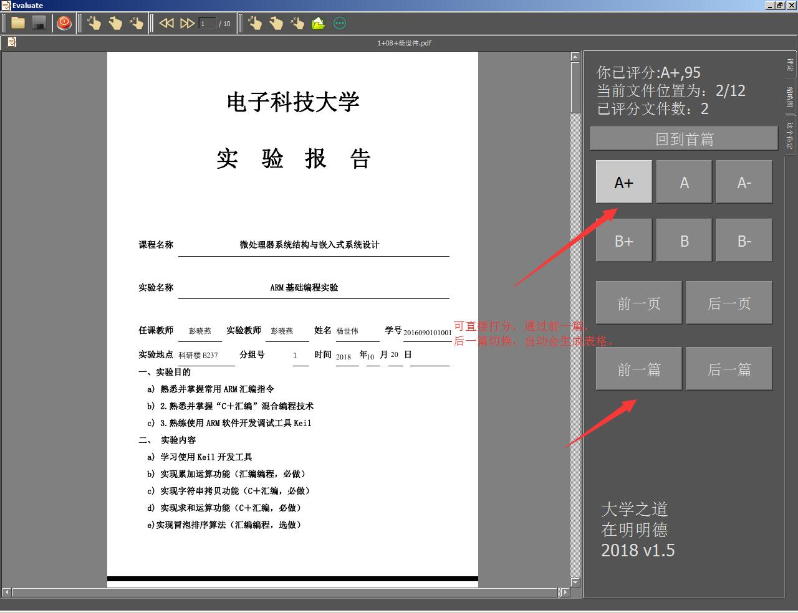
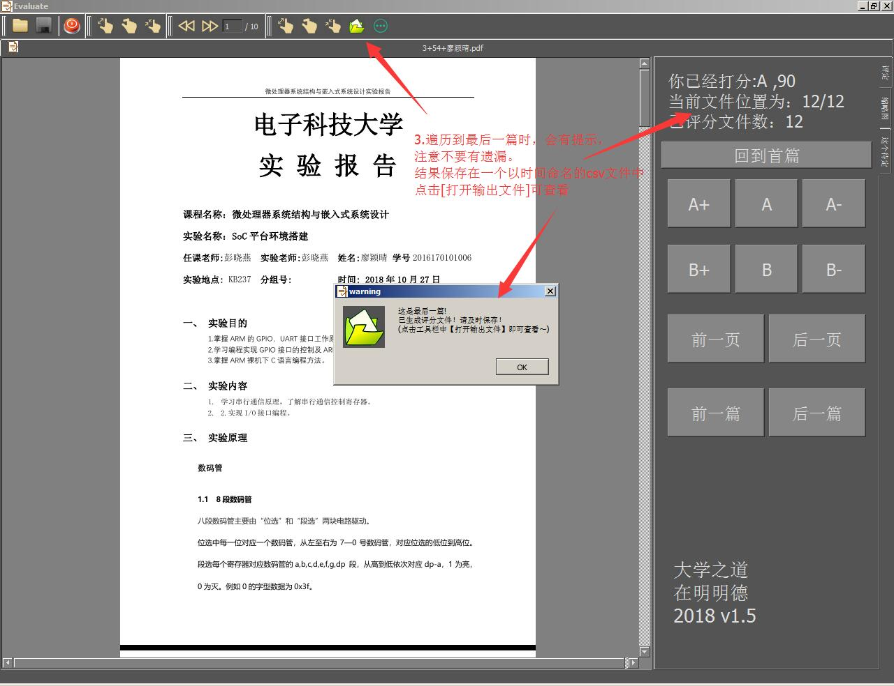
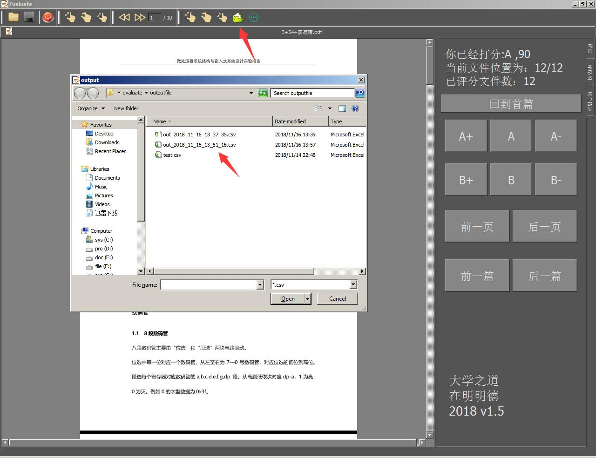
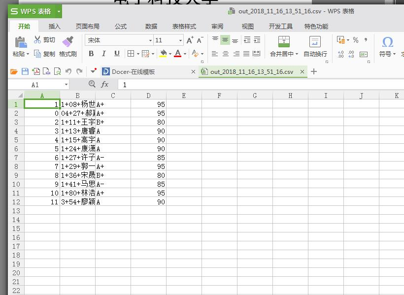

##Evaluate##
###给实验报告打分的软件
## 使用步骤：
###打开软件

###1.建议打开后，先回到首篇从第一篇开始打分。

###2.可直接打分，通过前一篇，后一篇切换，自动会生成表格。

###3.遍历到最后一篇时，会有提示，注意不要有遗漏。结果保存在一个以时间命名的csv文件中，点击[打开输出文件]可查看.

###4.点击[打开输出文件]查看csv文件。

###5.查看结果

###小结
	软件多有缺陷，望不吝赐教！
	联系邮箱：yjpkeep@163.com